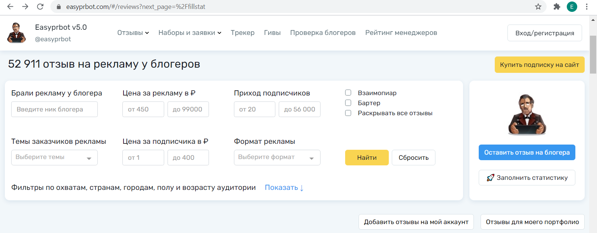

Keywords: ML, regression, EDA, visualization, Bokeh

# Advertisement in Russian-speaking Instagram

<table><tr><td></td><td></td></tr></table>

Several years ago when I finished my career of iternational accountant, but haven't started yet my path into Data Science, I used to have a travel-blog in Instagram.

Surprisingly for me, being a professional blogger was not simply about posting photos with funny captions and some hashtags. It was a full-time job that included studies of writing entertaining and useful texts, hours of communication with subscribers and other bloggers, planning various types of creative activities to attract new subscribers and, the most exhausting part, **searching for blogs where to buy personal advertisement**.

Even though blogging is only my hobby now, I'm interested in news and updates about blogging in Russian-speaking segment of Instagram. **Up until recently there was no instrument that could facilitate the process of searching for ad placement and evaluating its possible results**.

I suppose that the breakthrough in the bloggers' world was done by [blogger and entrepreneur Alexandra Mitroshina](https://www.instagram.com/alexandramitroshina/?hl=ru) who created [Easyprbot website](https://easyprbot.com/#/reviews). It is basically the database with feedbacks on personal advertisements in Instagram. Any blogger who ordered ad placement in another blog can upload review with information about price, statistics, income etc. Currently, there are over 50 000 reviews uploaded on the website.

 

Although this website is very useful if you want to check reviews on bloggers' ads and search for ad placement according to your budget, in general, there is no analytical tool to somehow speed up the process and evaluate future results of advertisement.

**In this project I intend to**:

- conduct exploratory data analysis of reviews collected on the website;

- create a model to evaluate perspective results of advertisement for any blog.

Along with theoretical analysis I will show how I would use it for my current [blog](https://www.instagram.com/data_newbie/) to choose ad placement in order to gain more subscribers.

**Pre-conditions and goal**:

- my budget: 10 000 RUB (appr. 130 $);

- my topics: travelling, feminism, studying data science, english, books and movies, social issues, cooking;

- more activity in stories, than posts;

- goal: 1500 - 2000 new subscribers.

​

# Data

Dataset with reviews from [Easyprbot website](https://easyprbot.com/#/reviews) was gathered on the 5th of March, 2021 using services of company [DataParse Lab](https://dataparselab.com/ru). The data from website was gathered exclusively for this training project and will not be used for any commercial reasons.

​

# Terminology

If you are not familiar with 'Instagram kitchen', let me disclose some terminology.

**Advertisement** - it's not official targeted advertising of Instagram, but personalized ad of one blogger (client) given by another blogger (executor).

**Price for subscriber** - price of advertisement divided by amount of new subscribers came after advertisement given (usually it's calculated after 24 hours). In my time an average and fair price for subscriber was 10 RUB (appr. 0.13 $).

**Income** - amount of new subscribers came after advertisement.

**Mutual PR**  -  activity when 2 bloggers advertise each other for free to attract subscribers of each other.

​

# Notebooks & Website

The project includes the following Notebooks with detailed analysis and code:

- [Advertisement in Russian-speaking Instagram - PART I.ipynb](https://github.com/ElinaAizenberg/Advertisement-in-Russian-speaking-Instagram---project/blob/main/_Advertisement%20in%20Russian-speaking%20Instagram%20-%20PART%20I.ipynb)
- [Advertisement in Russian-speaking Instagram - PART II.ipynb]()

If you are interested in more visually pleasant presentation of this project, please, visit my [website](https://www.elina-aizenberg-cv.com/instagram-project).

​

# Conclusion

So, this project was divided into 2 parts according to different goals: **to analyze Russian market of personal advertisement in Instagram to choose ad placement and to build a model to predict results of potential advertisement**.

In the first part I performed exploratary data analysis and found out some insights that were inline or contradicted my personal experience of blogging.

Average price for subscriber is 6-7 RUB (appr. 0,09 USD) and average price for advertisement is 3 000 RUB (appr. 40 USD), although the most frequent price is 1 000 RUB (appr. 13 USD). These calculations do not include extremely expensive advertisement for more than 200 000 RUB (appr. 2 668 USD).

There is a particular tendency in amount of advertisments across seasons: during winter and late autumn there are 1,5-2 times more ads' orders than during warm months. It might be explained with amount of time people spend inside and outside. Along with this trend, during cold and pre-holidays months there is a significant rise in expensive advertisements' cases.

There are 4 ad formats: Stories, Post + Stories, Photo-post, Video-post. Analysing median prices per topics, I found out that there are various trends inside topics: generally Post + Stories is the most expensive format, but in Sex and Relationships topics format Stories prevails. Unexpectedly, in allmost all popular topics Video-post costs less or the same as Photo-post.

Last step in the first part of the project was interactive scatter plot, using which you can set personal parameters and find the most promissing and successful advertisements.

The second part of the project was dedicated mainly to technical information about every step of building a model. Particularly, I described pre-processing and split of the dataset, explained what ML model might be used in the first place and explored whether the data suits its assumptions. Further, I performed feature selection to reduce risk of overfitting. By the end, I used 3 regression models with various hyperparameters and 2 metrics to choose which models provied the best results.

Finally, the model that fits best to the data was Random Forrest Regressor with 500 trees and maximum depth of 5 each. This model was used to create a function with set of advertisement's parameters that predicts amount of new subscribers coming after potential advertisement.

**The goal of the whole project is to facilitate the process of budgeting advertisement costs for bloggers, accelerate the process of searching for suitable and potentially successful ad placements and, finally, predict the outcome of bloggers' efforts and expenses.**
